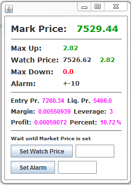

# Bybit Ticker

1. Sync your Windows time
2. On first start, it will create a <b>bybitconfig.txt</b> file.  
   Please add your apikey and apisecret  
   
   <b>Real</b> 
   apiKey=1234 -> use your own key 
   apiSecret=1234 -> use your own key 
   streamurl=wss://stream.bybit.com/realtime 
   apiurl=https://api.bybit.com  
   
   <b>Test</b> 
   apiKey=1234 -> use your own key 
   apiSecret=1234 -> use your own key 
   streamurl=wss://stream-testnet.bybit.com/realtime 
   apiurl=https://api-testnet.bybit.com 

